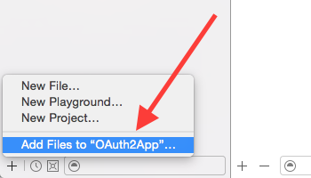

OAuth2
======

OAuth2 frameworks for **OS X** and **iOS** written in Swift.

Technical documentation is available at [p2.github.io/OAuth2](https://p2.github.io/OAuth2).
Take a look at the [OS X sample app][sample] for basic usage of this framework.

The code in this repo requires Xcode 6, the built framework can be used on **OS X 10.9** or **iOS 8** and later.
To use on **iOS 7** you'll have to include the source files in your main project.
_Note_ that it's possible to run embedded frameworks in iOS 7 with some tricks, however you will not be able to submit such an App to the App Store.
Supported OAuth2 [flows](#flows) are the _code grant_ (`response_type=code`) and the _implicit grant_ (`response_type=token`).

#### Swift Version

Since the Swift language is constantly evolving I have adopted a versioning scheme mirroring Swift versions:
the framework version's first two digits are always the Swift version the library is compatible with, see [releases](https://github.com/p2/OAuth2/releases).
Code compatible with brand new Swift versions are to be found on a separate branch named after their swift version.


Usage
-----

To use OAuth2 in your own code, start by importing it with `import OAuth2` (use `p2_OAuth2` if you installed via CocoaPods) in your source files.

For a typical code grant flow you want to perform the following steps.
The steps for other flows are mostly the same short of instantiating a different subclass and using different client settings.
If you need to provide additional parameters to the authorize URL take a look at `authorizeURLWithRedirect(redirect:scope:params:)`.

1. Create a settings dictionary.
    
    ```swift
    let settings = [
        "client_id": "my_swift_app",
        "client_secret": "C7447242-A0CF-47C5-BAC7-B38BA91970A9",
        "authorize_uri": "https://authorize.smartplatforms.org/authorize",
        "token_uri": "https://authorize.smartplatforms.org/token",
        "scope": "profile email",
        "redirect_uris": ["myapp://oauth/callback"],   // don't forget to register this scheme
        "keychain": false,  // if you DON'T want keychain integration
    ] as OAuth2JSON         // the "as" part may or may not be needed
    ```

2. Create an `OAuth2CodeGrant` instance. **Optionally**, set the `onAuthorize` and `onFailure` closures **or** just the `afterAuthorizeOrFailure` closure to keep informed about the status.
    Note that _afterAuthorizeOrFailure_ gets called immediately after either _onAuthorize_ or _onFailure_.
    Hence, unless you have a reason to, you don't need to set all three callbacks.
    
    ```swift
    let oauth2 = OAuth2CodeGrant(settings: settings)
    oauth2.viewTitle = "My Service"      // optional
    oauth2.onAuthorize = { parameters in
        println("Did authorize with parameters: \(parameters)")
    }
    oauth2.onFailure = { error in        // `error` is nil on cancel
        if nil != error {
            println("Authorization went wrong: \(error!.localizedDescription)")
        }
    }
    ```

3. There are three ways to have the user authorize:
    
    - An access token is still in the user's keychain
    - User logs in via OS browser
    - User uses a built-in web view (iOS only)
    
    By default the OS browser will be used if there is no access token present in the keychain.
    If you want to use the embedded web-view, change `oauth2.authConfig.authorizeEmbedded` to `true` (remember, currently iOS only) and set a root view controller, from which to present the login screen if needed, as the authorize context.
    Then call `authorize()`:
    
    ```swift
    oauth2.authConfig.authorizeEmbedded = true
    oauth2.authConfig.authorizeContext = <# presenting view controller #>
    oauth2.authorize()
    ```
    
    The `authorize()` method will:
    
    1. Check if an access token that has not yet expired is in the keychain, if not
    2. Check if a refresh token is in the keychain, if found
    3. Try to use the refresh token to get a new access token, if it fails
    4. Start the OAuth2 dance by using the `authConfig` settings to determine how to display an authorize screen to the user
    
    If you do not wish this kind of automation, the manual steps to show the authorize screens are:
    
    **Embedded (iOS only)**:
    
    ```swift
    let vc = <# presenting view controller #>
    let web = oauth2.authorizeEmbeddedFrom(vc, params: nil)
    oauth2.afterAuthorizeOrFailure = { wasFailure, error in
        web.dismissViewControllerAnimated(true, completion: nil)
    }
    ```
    
    **iOS/OS X browser**:
    
    ```swift
    if !oauth2.openAuthorizeURLInBrowser() {
        fatalError("Cannot open authorize URL")
    }
    ```
    
    Since you opened the authorize URL in the browser you will need to intercept the callback in your app delegate.
    Let the OAuth2 instance handle the full URL:
    
    **iOS**
    
    ```swift
    func application(application: UIApplication!,
                     openURL url: NSURL!,
               sourceApplication: String!,
                      annotation: AnyObject!) -> Bool {
        // you should probably first check if this is your URL being opened
        if <# check #> {
            oauth2.handleRedirectURL(url)
        }
    }
    ```
    
    **OS X**
    
    See the [OAuth2 Sample App][sample]'s AppDelegate class on how to receive the callback URL in your Mac app.

4. After everything completes either the `onAuthorize` or the `onFailure` closure will be called, and after that the `afterAuthorizeOrFailure` closure if it has been set.
You can use any of those.

5. You can now obtain an `OAuth2Request`, which is an already signed `NSMutableURLRequest`, to retrieve data from your server.
    
    ```swift
    let req = oauth.request(forURL: <# resource URL #>)
    let session = NSURLSession.sharedSession()
    let task = session.dataTaskWithRequest(req) { data, response, error in
        if nil != error {
            // something went wrong
        }
        else {
            // check the response and the data
            // you have just received data with an OAuth2-signed request!
        }
    }
    task.resume()
    ``` 


Flows
-----

Based on which OAuth2 flow that you need you will want to use the correct subclass.
For a very nice explanation of OAuth's basics: [The OAuth Bible](http://oauthbible.com/#oauth-2-three-legged).

#### Code Grant

For a full OAuth 2 code grant flow you want to use the `OAuth2CodeGrant` class.
This flow is typically used by applications that can guard their secrets, like server-side apps, and not in distributed binaries.
In case an application cannot guard its secret, such as a distributed iOS app, you would use the _implicit grant_ or, in some cases, still a _code grant_ but omitting the client secret.
It has however become common practice to still use code grants from mobile devices, including a client secret.
This class fully supports those flows, it automatically creates a “Basic” Authorization header if the client has a client secret.

#### Implicit Grant

An implicit grant is suitable for apps that are not capable of guarding their secret, such as distributed binaries or client-side web apps.
Use the `OAuth2ImplicitGrant` class to receive a token and perform requests.

Would be nice to add another code example here, but it's pretty much the same as for the _code grant_.

#### Client Credentials

A 2-legged flow that lets an app authenticate itself via its client id and secret.
Instantiate `OAuth2ClientCredentials`, as usual supplying `client_id` but also a `client_secret` – plus your other configurations – in the settings dict, and you should be good to go.


### Site-Specific Peculiarities

Some sites might not strictly adhere to the OAuth2 flow.
The framework deals with those deviations by creating site-specific subclasses.

- **Facebook**: `OAuth2CodeGrantFacebook` to deal with the [URL-query-style response](https://developers.facebook.com/docs/facebook-login/manually-build-a-login-flow/v2.2) instead of the expected JSON dictionary.
- **GitHub**: `OAuth2CodeGrant` automatically puts the client-key/client-secret into an “Authorization: Basic” header.
    GitHub however needs those two in the POSTed body; you need to set the `secretInBody` setting to true, either directly in code or via the `secret_in_body` key in the settings dictionary.
- **Reddit**: `OAuth2CodeGrant` automatically adds a _Basic_ authorization header when a client secret is set.
    This means that you **must** specify a client_secret; if there is none (like for [Reddit](https://github.com/reddit/reddit/wiki/OAuth2#token-retrieval-code-flow)) specify the empty string.
    There is a [RedditLoader](https://github.com/p2/OAuth2App/blob/master/OAuth2App/RedditLoader.swift) example in the [OAuth2App sample app][sample] for a basic usage example.
- **Google**: If you authorize against Google with a `OAuth2CodeGrant`, the built-in iOS web view will intercept the `http://localhost` as well as the `urn:ietf:wg:oauth:2.0:oob` (with or without `:auto`) callbacks.


Keychain
--------

This framework can transparently use the iOS and OS X keychain.
It is controlled by the `useKeychain` property, which can be disabled during initialization with the "keychain" setting.
Since this is **enabled by default**, if you do _not_ turn it off during initialization, the keychain will be queried for tokens related to the authorization URL.
If you turn it off _after_ initialization, the keychain will be queried for existing tokens, but new tokens will not be written to the keychain.

If you want to delete the tokens from keychain, i.e. **log the user out** completely, call `forgetTokens()`.


Installation
------------

You can use git or CocoaPods to install the framework.

#### CocoaPods

Add a `Podfile` that contains at least the following information to the root of your app project, then do `pod install`.
If you're unfamiliar with CocoaPods, read [using CocoaPods](http://guides.cocoapods.org/using/using-cocoapods.html).

```ruby
platform :ios, '8.0'      # or platform :osx, '10.9'
pod 'p2.OAuth2'
use_frameworks!
```

#### git

Using Terminal.app, clone the OAuth2 repository, best into a subdirectory of your app project:  

    $ cd path/to/your/app
    $ git clone --recursive https://github.com/p2/OAuth2.git

If you're using git you'll want to add it as a submodule.
Once cloning completes, open your app project in Xcode and add `OAuth2.xcodeproj` to your app:



Now link the framework to your app:


These three steps are needed to:

1. Make your App also build the framework
2. Link the framework into your app
3. Embed the framework in your app when distributing

> NOTE that as of Xcode 6.2, the "embed" step happens in the "General" tab.
> You may want to perform step 2 and 3 from the "General" tab.
> Also make sure you select the framework for the platform (OS X vs. iOS).
> This is currently a bit tricky since Xcode shows both as _OAuth2.framework_; I've filed a bug report with Apple so that it also shows the target name, fingers crossed.


License
-------

This code is released under the [_Apache 2.0 license_](LICENSE.txt), which means that you can use it in open as well as closed source projects.
Since there is no `NOTICE` file there is nothing that you have to include in your product.


[sample]: https://github.com/p2/OAuth2App

